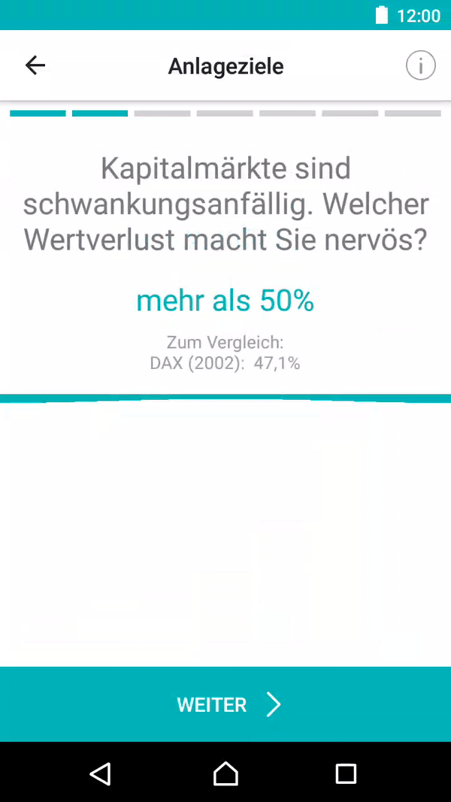

# RubberBandView

A custom view that simulates the behaviour of a rubber band for Android. More details [here](https://engineering.scalable.capital/2018/02/25/rubberbandview-a-custom-view.html).



## Usage

### Minimum setup

In your layout file:

```
<capital.scalable.droid.rubberbandview.RubberBandView
    android:layout_width="match_parent"
    android:layout_height="match_parent" />
```

### Max selectable value

To configure the max selectable value:
```
rubberBandView.setMaxSelection(10);
```


### RubberBandListener

To receive updates to the selected value:

```
rubberBandView.setListener(new RubberBandListener() {
    @Override
    public void onSelectionChanged(int value) {
        Toast.makeText(MainActivity.this, "Selection changed to " + value, Toast.LENGTH_SHORT).show();
    }

    @Override
    public void onSelectionFinished(int value) {
        Toast.makeText(MainActivity.this, "Selection ended with value " + value, Toast.LENGTH_SHORT).show();
    }
});
```

### Vibration animation

The view comes with a nudge animation, that encourages the user to interact with it.
To configure it, supply your own [ValueAnimator](https://developer.android.com/reference/android/animation/ValueAnimator.html) through `rubberBandView.setVibrationAnimator()`
To turn the animation off completely, simply set the vibration animator to null.

### UI Customization

These are the parameters that can be modified through xml:

```
<capital.scalable.droid.rubberbandview.RubberBandView
    app:loosenessRatio="0.2"
    app:rubberColor="@color/colorAccent"
    app:minRubberWidth="4dp"
    app:maxRubberWidth="5dp"
    app:vibrationPeakAmplitude="3dp"
    android:layout_width="match_parent"
    android:layout_height="match_parent" />
```

- `loosenessRatio`: how loose the rubber needs to be. Must be in [0,1[ range. Defaults to 0.2
- `rubberColor`: the color of the rubber. Defaults to the theme's `colorAccent`
- `minRubberWidth`: the minimum width of the rubber band, in dp. This will be the width when the rubber band is pulled to its max.
- `maxRubberWidth`: the maximum width of the rubber band, in dp. This will be the width when the rubber band is at rest.
- `vibrationPeakAmplitude`: the maximum displacement of the rubber band when vibrating, in dp.


## Installation

``` groovy
repositories {
    maven { url "https://jitpack.io" }
}


dependencies {
    implementation "com.github.ScaCap:RubberBandView:1.0.0"
}
```

## License

FIFOCache is Open Source software released under the [Apache 2.0 license](http://www.apache.org/licenses/LICENSE-2.0.html).
